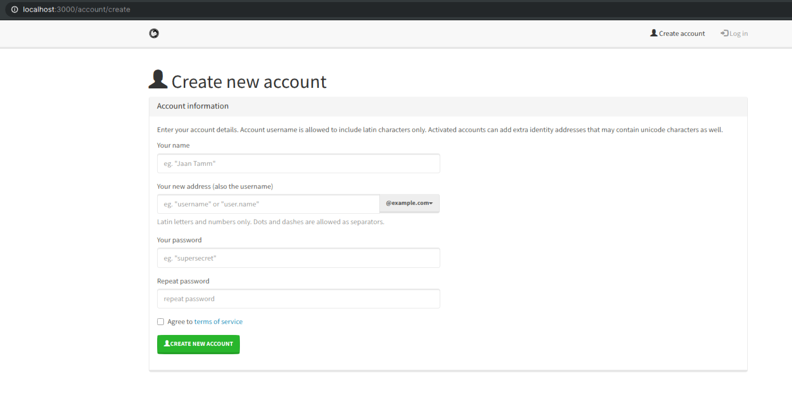
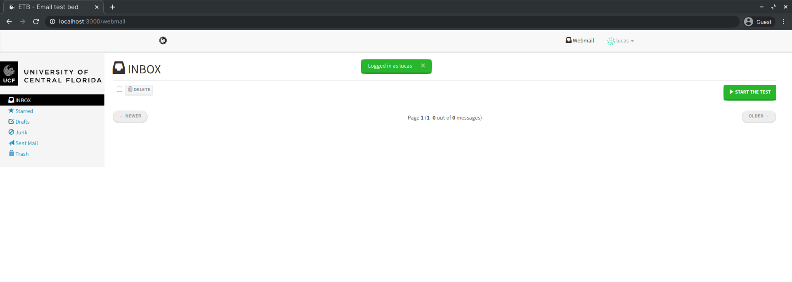

# EmailTestBed-wildduck-webmail

This is the email client (webmail) and acts as frontend to the wildduck server. **Remenber to start the backend project before start this project.** 

## How to start

You can run the project using the node.js (v14) installed in your machine or using docker / docker-compose

# Run using node.js

1. First, donwload it from the https://nodejs.org/en/download/. It's compatible with node 12 and 14. Probably other versions
will be compatible too but I didn't test.
2. Other option to install node is using nvm (node version manager). This allow you easily switch between the nodejs versions. https://github.com/nvm-sh/nvm
3. commands to build and run the aplication locally:

## Install the dependencies 

`npm install && npm run bowerdeps`

## Run the application

`node server.js --config=config/default.toml`

4.If everything is ok, you can access the webapp on http://localhost:3000

----------
# Run using Docker

## Installing docker and docker-compose

### Docker

You should access https://docs.docker.com/get-docker/ and follow the instructions to install docker in your machine.

### Docker Compose

Docker compose is used as container orchestrator. Basically it will define how the containers must be configured.

To install, https://docs.docker.com/compose/install/

### Running the project locally

this command will build and run the application. The container name is `etb-wd-webmail`

`docker-compose -f docker/docker-compose-local.yml up --build --force-recreate`

Alternatively you can use the `-d` switch to run the project in daemon mode.

`docker-compose -f docker/docker-compose-local.yml up --build --force-recreate -d`

**Docker commands:**

Check running containers:
`docker ps`

Check logs:
`docker logs -f --tail 1000 etb-ed-webmail`

Stop container:
`docker stop etb-ed-webmail`

Start container:
`docker start etb-ed-webmail`

Restart container:
`docker restart etb-ed-webmail`

# Language

English

# Preview

